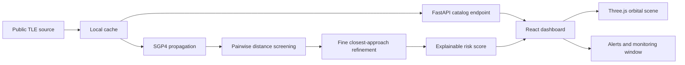

# ARGUS-LEO

ARGUS-LEO is a transparent Low Earth Orbit (LEO) conjunction-screening dashboard. It ingests public Two-Line Element (TLE) data, propagates satellite positions with SGP4, screens satellite pairs for close approaches, calculates an explainable risk score, and presents the result in a rotatable Three.js mission-control interface.

It is a screening and education layer, not an operational collision-avoidance system.

## First-time user guide

The simplest way to understand the product is:

> The globe shows where tracked satellites are predicted to travel. The red conjunction marker identifies a predicted close approach between two objects. The right rail explains the event and its risk score.

### The top pipeline

The header shows the three stages of the system:

1. **Perceive** — ingest TLE data and propagate satellite state vectors.
2. **Reason** — compare satellite pairs and calculate an explainable score.
3. **Execute** — present alerts and monitoring windows for analyst triage.

### The left navigation

- **Live View** — the main orbital monitoring scene.
- **Risk Alerts** — flagged close-approach events.
- **Conjunctions** — the pairwise screening view.
- **Catalog** — the current satellite working set.
- **Analytics** — summary and distribution views.
- **Settings** — future configuration surface.

The current product flow is centered on **Live View**.

### The globe

The globe is an orbital model, not a live satellite photograph or Google Earth map.

- Earth is the reference body at the center.
- Colored curves are predicted orbital paths.
- Small spacecraft models mark satellite positions.
- The scene uses an Earth-centered inertial (ECI) coordinate frame.
- Stars, atmosphere, and cloud puffs improve spatial orientation but are not telemetry.
- Drag rotates the scene; the mouse wheel zooms it.

The orbit paths are generated from propagated state vectors over the selected screening window. They are not ground tracks drawn across a geographic map.

### Satellites and alerts

A satellite marker represents an orbital object returned by the catalog or screening API. Its position is calculated from its TLE epoch and SGP4 propagation.

The red pulse and warning cone represent a predicted closest-approach event. They do not mean that a collision is happening. The selected alert explains:

- miss distance,
- closest-approach time (CAO),
- relative speed,
- explainable risk score,
- monitoring window.

### Why the globe can show only two satellites

There are three different counts in the interface:

- **Objects** — total satellites in the current catalog, currently 20 in the committed demo cache.
- **Risk alerts** — flagged close-approach events, not individual satellites.
- **Selected pair** — the two objects currently emphasized in the scene.

The fallback scene intentionally renders two example spacecraft (`STARLINK-1043` and `STARLINK-1067`) before a screening response is available. In live mode, the frontend renders the returned position series. Other objects can still be present but visually small, overlapping, or not selected. The right rail may show two alerts even though the catalog contains 20 objects.

### Screening controls

- **Monitoring threshold** — distance below which a pair is flagged. This is a triage threshold, not a collision threshold.
- **Window** — how far into the future to screen, from 12 to 48 hours.
- **Step** — how frequently to sample propagated positions.
- **Working set** — the satellite group to screen.
- **Run Screening** — sends the settings to the FastAPI backend and recalculates positions, alerts, and scores.

### Right rail and overview strip

The right rail contains the conjunction queue and selected orbital-object metadata:

- **Risk score** is an explainable 0–100 triage score, not a collision probability.
- **Miss distance** is the predicted minimum separation.
- **CAO** is the time of closest approach.
- **NORAD ID, altitude, inclination, and velocity** describe the selected object.

The bottom overview summarizes catalog size, flagged events, high-risk events, monitored objects, and risk-level distribution.

## Data flow



## Technical stack

### Backend

- Python
- FastAPI
- Skyfield and SGP4 propagation
- NumPy pairwise screening
- Pydantic API models
- Cached TLE data for reproducible demo startup

### Frontend

- React 18
- TypeScript
- Vite
- Three.js
- `@react-three/fiber`
- `@react-three/drei`
- Zustand
- Custom low-poly Earth scene with local texture assets
- Responsive dark mission-control UI

## Repository structure

```text
Sentry/
├── backend/
│   ├── api.py              # FastAPI application and routes
│   ├── fetch_tle.py        # TLE refresh and cache handling
│   ├── models.py           # Pydantic request/response models
│   ├── propagate.py        # SGP4 propagation helpers
│   ├── risk_score.py       # proximity + closing-speed scoring
│   ├── screen.py           # pairwise screening
│   ├── data/               # committed demo TLE cache
│   └── tests/              # backend unit tests
├── frontend/
│   ├── src/App.tsx         # dashboard composition
│   ├── src/components/     # scene, panels, navigation, metrics
│   ├── src/store.ts         # Zustand application state
│   ├── src/api.ts           # backend response mapping
│   ├── src/styles.css       # responsive mission-control styling
│   └── public/textures/     # Earth surface, normal, and cloud textures
├── docs/                   # PRD, schema, design, app flow, and tracker
├── LICENSE
└── README.md
```

## Run locally

### 1. Start the backend

From the repository root on Windows PowerShell:

```powershell
python -m venv backend/.venv
backend/.venv/Scripts/python.exe -m pip install -r backend/requirements.txt
backend/.venv/Scripts/python.exe -m uvicorn backend.api:app --reload --port 8000
```

The backend is available at `http://127.0.0.1:8000`.

- Swagger/OpenAPI: `http://127.0.0.1:8000/docs`
- Health check: `GET /api/health`

### 2. Start the frontend

In a second terminal:

```powershell
cd frontend
npm.cmd install
npm.cmd run dev
```

Open `http://127.0.0.1:5173`.

The Vite development server proxies `/api` to the backend at `http://127.0.0.1:8000`.

## API surface

| Method | Route | Purpose |
|---|---|---|
| `GET` | `/api/health` | API liveness and TLE cache age |
| `GET` | `/api/satellites` | Current cached working set and freshness |
| `POST` | `/api/screen` | Propagation, pair screening, refinement, and scoring |
| `POST` | `/api/refresh-tle` | Rate-limit-aware TLE refresh |
| `GET` | `/api/alerts/{alert_id}` | Alert detail for the current screening configuration |

`POST /api/screen` accepts:

```json
{
  "window_hours": 24,
  "step_minutes": 5,
  "threshold_km": 50,
  "satellite_group": "starlink"
}
```

## Risk model

The current score combines two interpretable factors:

```text
risk score = proximity factor × 70% + closing-speed factor × 30%
```

The score is intended for prioritization and explanation. It is not a probability of collision and it does not generate maneuver burns.

## Validation

Run backend tests:

```powershell
backend/.venv/Scripts/python.exe -m pytest backend/tests -q
```

Build the frontend:

```powershell
cd frontend
npm.cmd run build
```

## Operational limitations

ARGUS-LEO is intentionally a screening and education prototype.

- TLE/SGP4 accuracy degrades as the TLE epoch gets older.
- The configured monitoring threshold is not a collision threshold.
- Pair screening is not an official conjunction assessment service.
- No maneuver planning or burn generation is implemented.
- A production workflow would require higher-fidelity ephemerides, covariance data, validated propagation, and operational review procedures.

The local TLE cache is committed for demo resilience. Avoid repeatedly refreshing live groups during development because upstream catalog services may be rate limited.

## Project documentation

Detailed product, architecture, schema, design, and implementation notes are available in [`docs/`](docs/):

- [`01. PRD.md`](docs/01.%20PRD.md)
- [`02. Techspec.md`](docs/02.%20Techspec.md)
- [`03. Appflow.md`](docs/03.%20Appflow.md)
- [`04. Design.md`](docs/04.%20Design.md)
- [`05. Schema.md`](docs/05.%20Schema.md)
- [`06. ImplementationPlan.md`](docs/06.%20ImplementationPlan.md)
- [`07. Tracker.md`](docs/07.%20Tracker.md)
- [`08. Rules.md`](docs/08.%20Rules.md)

## License

MIT. See [`LICENSE`](LICENSE).
